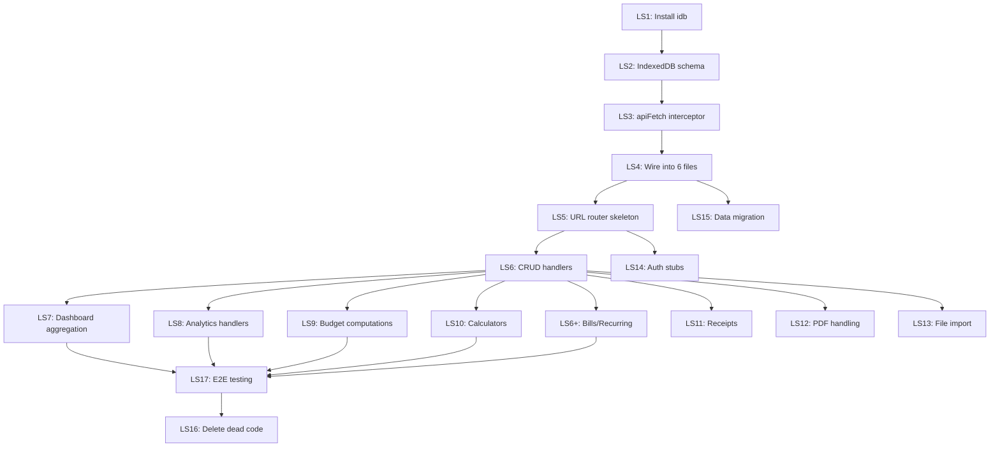

# Remaining Issues Plan — Post-Migration Gap Closure

> **Branch:** `fix/migration-full-plan` (SolidJS + Vite + TypeScript)  
> **Reference branches:** `special/old-js-app-fixed` (Vanilla JS), `main`, `origin/feat/annual-pdf-puppeteer`  
> **Generated:** 2026-05-06  
> **Predecessors:** [migration_final_plan.md](./migration_final_plan.md), [home-stretch.plan](../plan/home-stretch.plan)

---

## Table of Contents

1. [Previous Plan Status Audit](#1-previous-plan-status-audit)
2. [PR #188 / feat/annual-pdf-puppeteer Analysis](#2-pr-188--featannual-pdf-puppeteer-analysis)
3. [Old JS App Feature Gap Analysis](#3-old-js-app-feature-gap-analysis)
4. [Remaining Issues — Prioritized Phases](#4-remaining-issues--prioritized-phases)
5. [Files to Modify Summary](#5-files-to-modify-summary)
6. [Open Questions](#6-open-questions)

---

## 1. Previous Plan Status Audit

### From `migration_final_plan.md`

| # | Item | Status | Evidence |
|---|------|--------|----------|
| **F1** | Route name mismatch (`rent-buy` → `rentBuy`) | ✅ Fixed | `App.tsx:237` now uses `'rentBuy' as PageName` |
| **F2** | Transaction save button | ✅ Fixed | No longer calls `openTransactionModal()` for save |
| **F3** | Replace 16 `data-action` attributes | ✅ Fixed | `grep -rn data-action frontend/src/` returns 0 results |
| **F4** | Async `createEffect` in App.tsx | ✅ Fixed | No async createEffect found |
| **F5** | Load categories in transaction form | ✅ Fixed | Categories loaded from API |
| **F6** | CSS module convention | ✅ Fixed | `localsConvention: 'camelCase'` in `vite.config.ts:140` |
| **F7** | Replace 52+ raw class strings | ⚠️ Partial | Some raw class strings remain in templates |
| **F8** | Remove 20 orphan CSS modules | ✅ Fixed | All 60 CSS modules are imported |
| **F9** | Deduplicate global vs module CSS | ⚠️ Partial | `base.css` and `components.css` removed, but `index.css` may still have duplicates |
| **F10** | Remove unused `Sidebar.tsx` | ❓ Unknown | Need to verify — component file still exists |
| **F11** | Replace `.map()` with `<For>` | ⚠️ Partial | `App.tsx:501,547` still use `.map()` (static arrays OK, but `Object.entries(allPages)` is debatable) |
| **F12** | Replace `document.getElementById` / `classList` | 🔴 Open | **35 instances** in `handlers.ts`, 4 in feature components |
| **F13** | Move modals to signal-based control | ⚠️ Partial | `LoginModal`, `QuickAddModal` use signals; Transactions modal still has `classList.contains` |
| **F14** | Wire MoM delta calculation | ❓ Unknown | Need to verify Dashboard implementation |
| **F15** | ESLint auto-fix | ❓ Unknown | |
| **F16** | Fix import resolver config | ❓ Unknown | |

### From `home-stretch.plan`

| Phase | Item | Status | Evidence |
|-------|------|--------|----------|
| **1.1** | Fix broken filters (category, tag, period) | ⚠️ Partial | Filters exist but wiring needs verification |
| **1.2** | Missing table columns (reconcile, category dot, delete, counterparty, sort) | ⚠️ Partial | `TransactionTable.tsx` exists but features need verification |
| **1.3** | Pagination info/page size/totalItems | ⚠️ Partial | `Pagination.tsx` exists |
| **1.4** | Fix selection bug (checkbox triggers API reload) | ❓ Unknown | |
| **1.5** | Recurring transactions | ✅ Done | `RecurringSection.tsx` exists and is wired |
| **2.1** | Remove duplicate theme toggle | ❓ Unknown | |
| **2.2** | Fix PDF exports (export HTML templates) | ✅ Done | `export-monthly.html` (461 lines) and `export.html` (536 lines) exist |
| **2.3** | Export format selection | ✅ Done | Commit `93d7b76` added export format selector |
| **3.1** | Fix infinite scroll (Chart.js height feedback loop) | ❓ Unknown | Chart component exists |
| **3.2** | Fix amortization table overflow | ✅ Done | Commit `d166b5d` added scroll/sticky headers |
| **3.3** | Clean LoansPage CSS duplication | ✅ Done | Commit `d166b5d` |
| **4.1** | Fix budget double-fire | ✅ Done | Commit `853fd98` |
| **4.2** | Remove redundant API call | ✅ Done | Commit `853fd98` |
| **4.3** | Add missing DB index | ✅ Done | Commit `853fd98` |
| **4.4** | Add request debouncing | ❓ Unknown | |
| **5.1** | Restore 4-column stat cards | ✅ Done | Commit `53fecec` |
| **5.2** | Fix net worth data source | ❓ Unknown | |
| **5.3** | Change MoM format to percentage | ❓ Unknown | |
| **5.4** | Restore 12-month bar chart | ❓ Unknown | |
| **5.5** | Chart grid layout (1fr 1fr) | ✅ Done | Commit `53fecec` |
| **6.1** | Fix session store (`resave: false`) | ⚠️ Partial | `resave: false` ✅, but `saveUninitialized: true` still on line 249 |
| **6.2** | Add composite transaction index | ✅ Done | Commit `853fd98` |
| **6.3** | Remove debug `console.log` | ✅ Done | No category mapping console.log found |
| **6.4** | Fix duplicate route registration | ✅ Done | No duplicate categories/mappings route |
| **6.5** | Parallelize dashboard queries | ❓ Unknown | |
| **6.6** | Fix sync file I/O in error logger | 🔴 Open | `fs.readFileSync` and `fs.writeFileSync` still in `backend/index.js:134,147,425,450` |
| **7.1** | Emoji scan | ✅ Done | Commits `364463d`, `b155717` |
| **7.2** | CSS parity | ⚠️ Partial | Ongoing work |

---

## 2. PR #188 / feat/annual-pdf-puppeteer Analysis

> **TL;DR: NOT a regression. The feature is already present in our branch.**

### What `feat/annual-pdf-puppeteer` did

The branch (commit `21dae82`) converted the annual PDF report endpoint from:
- **Before:** `POST /api/reports/annual-pdf` — client sends base64 chart images in the request body
- **After:** `GET /api/reports/annual-pdf` — server fetches data, launches Puppeteer, navigates to `export.html`, renders Chart.js charts server-side, captures a screenshot, embeds it in the PDF

### Is this in our branch?

**Yes.** The current `backend/index.js` (line 7883) has:

```javascript
// Uses puppeteer to render charts via a dedicated export page, then embeds screenshot in PDF
app.get('/api/reports/annual-pdf', apiRateLimiter, async (req, res) => {
```

This is the Puppeteer-based version. It:
1. Fetches data server-side (category breakdown, monthly income/expense)
2. Launches Puppeteer, injects `__DATA__` into the page
3. Navigates to `export.html` (which exists at `frontend/export.html`, 536 lines)
4. Waits for `window.__RENDER_DONE__` signal
5. Takes a screenshot and embeds it in the PDF
6. Falls back to text-only PDF if Puppeteer fails

### Monthly PDF also has Puppeteer

The monthly PDF endpoint (`/api/reports/monthly-pdf`, line 7070) does the same:
- Renders `export-monthly.html` (461 lines) via Puppeteer
- Falls back to text-only PDFKit if Puppeteer unavailable

### Conclusion

The `feat/annual-pdf-puppeteer` branch was merged into `main` before our `fix/migration-full-plan` branch was created. **No action needed** — server-side Puppeteer chart rendering is fully present. The old JS app's charts worked in PDFs for the same reason: the backend was already doing server-side rendering.

---

## 3. Old JS App Feature Gap Analysis

Comparing `special/old-js-app-fixed` frontend features against `fix/migration-full-plan`:

### Features Present in Both ✅

| Feature | Old App File | SolidJS File |
|---------|-------------|-------------|
| Dashboard with 4 stat cards + MoM | `dashboard.js` | `Dashboard.tsx` |
| Dashboard charts (category, monthly, cashflow, net worth) | `dashboard.js` | `Dashboard.tsx` |
| Savings rate card | `dashboard.js` | `Dashboard/SavingsRateCard.tsx` |
| Budget alerts card | `dashboard.js` | Exists in Dashboard |
| Recurring insights card | `dashboard.js` | `Dashboard.tsx` |
| Transaction CRUD | `transactions.js` | `Transactions.tsx` |
| Recurring transactions | `transactions.js:339+` | `RecurringSection.tsx` |
| Tag filtering | `transactions.js:34-97` | `Tags/TagFilter.tsx`, `Tags/TagInput.tsx` |
| Category multi-select filter | `transactions.js:101+` | `CategoryMultiSelect.tsx` |
| Period presets (This Month, Last Month, Year) | `transactions.js` | `PeriodPills.tsx` |
| Bulk edit | `bulkEdit.js` | `BulkActionBar.tsx` |
| Quick add modal | `quickadd.js` | `QuickAddModal.tsx` + Ctrl+Shift+T shortcut ✅ |
| Analytics (charts, comparison, heatmap, sankey) | `analytics.js`, `heatmap.js` | `Analytics.tsx`, `D3HeatmapChart.tsx`, `SankeyChart.tsx` |
| Chart export | `chartExport.js` | `ExportChartButton.tsx` |
| Budget page with charts | `budgets.js` | `Budgets.tsx` with Chart component |
| Loan calculator with amortization | `loans.js` | `Loans.tsx`, `LoanAmortizationTable.tsx` |
| PDF reports (monthly, annual, tax, P&L) | `settings-reports.js` | `Settings.tsx` |
| Export (CSV/JSON) with format selector | `settings-reports.js` | `Settings.tsx` |
| Import page | `import.js` | `Import.tsx` |
| Housing calculator | `housingCalc.js` | `Housing.tsx` |
| Retirement planner | `retirement.js` | `Retirement.tsx` |
| Savings goals | `savingsGoals.js` | `Goals.tsx` |
| Categories/Accounts | `categories-accounts.js` | `Categories.tsx`, `Accounts.tsx` |
| Login/Auth | `core/auth.js` | `LoginModal.tsx` |
| Profile management | `core/profile.js` | `ProfileModal.tsx` |
| Theme toggle | `core/theme.js` | Theme store + `Settings.tsx` (single toggle, no duplication) |
| Mobile sidebar toggle | `core/router.js` | `App.tsx:530` (hamburger button exists) |
| Danger zone | N/A in old app | `DangerZone.tsx` |

### Features/Quality Gaps Still Open ⚠️

| # | Gap | Severity | Details |
|---|-----|----------|---------|
| G1 | `handlers.ts` is a 500-line legacy bridge | 🔴 High | Contains 35 `document.getElementById` calls, `window.handlers/receipts/transactions` globals. This entire file needs to be refactored into SolidJS components. |
| G2 | Transaction modal uses DOM-based receipt handling | 🟡 Medium | Receipt upload/preview/remove is all DOM-based via `handlers.ts:53-77` |
| G3 | Transaction type selector may still depend on legacy handlers | 🟡 Medium | `handlers.ts:127,213-214` references `window.transactionsSetType` |
| G4 | Receipt viewing uses DOM modal | 🟡 Medium | `handlers.ts:231-233` opens receipt modal via `document.getElementById` |
| G5 | Old app had 12-month income vs expense bar chart on dashboard | 🟡 Medium | Need to verify current dashboard renders 12 months, not just current period |
| G6 | Old app showed % deltas on stat cards | 🟢 Low | Need to verify SolidJS shows `▲ 5.3%` style, not raw amounts |
| G7 | Budget improvement tracking charts (line chart + donut) | 🟡 Medium | Old app had `improvementChart` + `budgetDonutChart` — verify in SolidJS |
| G8 | Loan detail charts per-loan (balance, P&I split) | 🟡 Medium | Old app rendered per-loan charts in `renderLoanDetails` — verify |
| G9 | Backend performance — perceived slowness | 🟡 Medium | User reports ~5 second response times. Needs profiling — see [Issue #180 Analysis](#35-issue-180-comment-cross-reference) |
| G10 | Transaction page UX far from old app | 🟡 Medium | Sorting works but visual parity (year/month dropdowns, filter bar layout) needs comparison |
| G11 | Layout differences across pages | 🟢 Low | Dashboard, Analytics, Retirement, Settings layouts need visual comparison against old app screenshots |
| G12 | Dashboard cards overlap / visual bugs | 🔴 High | Multiple visible issues: (1) **Budget Alerts** header renders twice (duplicate heading). (2) **Recurring Insights** card text is clipped — the "No recurring transactions found" message and sub-text overflow behind the donut chart. (3) **Income vs Expenses** chart legend shows "undefined" instead of a dataset label. (4) **Savings Rate** card content appears truncated at the bottom. Root cause likely: missing `overflow: hidden` on card containers, chart canvas not respecting parent bounds, and/or grid row sizing issues in the dashboard layout. |

---

### 3.5 Issue #180 Comment Cross-Reference

> Source: [GitHub Issue #180 Comment](https://github.com/Komediruzecki/finance-manager/issues/180#issuecomment-4382439673)

The user's comment raises 8 specific concerns. Here's the status of each:

| # | Concern from Comment | Already in Plan? | Status | Notes |
|---|---------------------|-----------------|--------|-------|
| 1 | **Settings: Duplicate theme toggle** | ✅ Yes (home-stretch §2.1) | ✅ Fixed now | The checkbox `<input>` was visible alongside the styled toggle slider because `SettingsPage.module.css` was missing `input { display: none }` on `.toggle-switch`. Also, `transform: translate-x(20px)` was invalid CSS (should be `translateX` — no hyphen), so the slider knob never moved when checked. **Both bugs fixed.** |
| 2 | **Settings: Exports lack yearly summary / "All Months" option** | ✅ Yes (home-stretch §2.2-2.3) | ✅ Resolved | `Settings.tsx:129` has `<option value="0">All Months (Full Year)</option>`. Export format selector added in commit `93d7b76`. |
| 3 | **Settings: PDF exports need rendered charts (Puppeteer + HTML templates)** | ✅ Yes (§2 PR analysis) | ✅ Resolved | `export-monthly.html` (461 lines) and `export.html` (536 lines) exist. Backend uses Puppeteer to render Chart.js server-side with `__RENDER_DONE__` signal. Falls back to PDFKit text-only. |
| 4 | **Transactions: Filtering, sorting, year/month — not implemented** | ✅ Yes (home-stretch §1.1-1.3) | ⚠️ Partial | Sorting IS implemented (`Transactions.tsx:79-80`, `TransactionTable.tsx:24-97`). Filtering IS implemented (category multi-select, tags, date presets, search). Year/month filter dropdowns exist. BUT: need visual parity check against old app screenshots for layout match. |
| 5 | **Performance: ~5 second backend response times** | 🆕 New | 🔴 Open | Rate limiter is 300 req/min (not throttling). `saveUninitialized: true` creates unnecessary sessions. `fs.readFileSync`/`fs.writeFileSync` blocks event loop. Dashboard queries are sequential. Added as Phase 3 tasks (B1-B3). **Additionally:** need to investigate if any specific queries are slow (missing indexes, N+1 patterns). |
| 6 | **Dashboard layout differs from old app** | ✅ Yes (home-stretch §5.1-5.5) | ⚠️ Partial | 4-column stat cards restored. Chart grid layout fixed. But net worth source and MoM format need verification. |
| 7 | **Budget page performance** | ✅ Yes (home-stretch §4.1-4.4) | ✅ Resolved | Double-fire bug fixed in commit `853fd98` (removed duplicate `onMount` + `createEffect` calls, reducing API calls from 8 to 4). Missing DB index added. |
| 8 | **Loan calculator infinite scroll** | ✅ Yes (home-stretch §3.1) | ❓ Unknown | Chart.js responsive feedback loop fix was planned — need to verify if applied. |

**New items from this comment that were NOT yet in the plan:**

- **Performance investigation** (G9): While individual fixes exist (session config, async I/O, parallel queries), the user reports a holistic ~5-second perceived slowness. This suggests we need a **profiling pass** — timing middleware on key endpoints to find the actual bottleneck.
- **Visual layout parity** (G10, G11): The screenshots in the comment show significant visual differences between old and new apps. While the underlying features exist, the CSS layouts (grid proportions, card padding, filter bar placement) may not match.

---

## 4. Remaining Issues — Prioritized Phases

### Phase 1: Eliminate `handlers.ts` Legacy Bridge (P0 — Critical)

> This is the single largest remaining technical debt item. The file is a 500-line bridge between the old vanilla JS event system and SolidJS. It uses 35 `document.getElementById` calls and exposes `window.handlers`, `window.receipts`, `window.transactions` globals.

| # | Task | Est. | Files |
|---|------|------|-------|
| H1 | **Refactor receipt handling into SolidJS signals** — Move receipt upload/preview/remove from DOM-based handlers into the Transactions component using `createSignal` for state and `ref` for elements | 3h | `Transactions.tsx`, `handlers.ts` |
| H2 | **Refactor transaction type selector** — Remove `window.transactionsSetType` global, use SolidJS signal directly | 30min | `Transactions.tsx`, `handlers.ts` |
| H3 | **Refactor receipt view modal** — Create a `ReceiptViewModal.tsx` component with signal-based visibility | 1h | New `ReceiptViewModal.tsx`, `handlers.ts` |
| H4 | **Remove `window.handlers/receipts/transactions` assignments** from `App.tsx:21-24` | 15min | `App.tsx` |
| H5 | **Delete or gut `handlers.ts`** once all references are migrated | 30min | `handlers.ts` |

### Phase 2: SolidJS Pattern Cleanup (P1)

| # | Task | Est. | Files |
|---|------|------|-------|
| S1 | Replace remaining `.map()` with `<For>` where data is reactive | 30min | `App.tsx` (line 547), any other reactive maps |
| S2 | Fix Transaction modal `classList.contains` usage (lines 577, 918) — use signal-based overlay dismiss | 30min | `Transactions.tsx` |
| S3 | Audit and remove any remaining `document.getElementById` outside `handlers.ts` | 30min | Various |
| S4 | **Fix `createSignal` outside `createRoot`** — causes the SolidJS warning: *"cleanups created outside a `createRoot` or `render` will never be run"*. See detailed analysis below. | 1h | `core/toastStore.ts`, `stores/index.ts` |

#### S4 Detail: SolidJS `createRoot` Warning Analysis

The SolidJS runtime warns when reactive primitives (`createSignal`, `createEffect`, `onCleanup`) are used outside a reactive ownership tree (i.e., outside `render()` or `createRoot()`).

**Root cause identified — 2 files:**

| File | Line | Problem | Fix |
|------|------|---------|-----|
| `core/toastStore.ts` | 13 | `const [toasts, setToasts] = createSignal<ToastItem[]>([])` at **module top-level**. This runs during ES module evaluation, before `render()` creates the root. | Wrap in `createRoot()`: `const [toasts, setToasts] = createRoot(() => createSignal<ToastItem[]>([]))` — OR move into a factory function and call it from within a component tree. |
| `stores/index.ts` | 154 | `createEffect()` inside `createThemeStore()` — and all `create*Store()` factories use `createSignal`. If `initializeStores()` is called outside a reactive root, all these signals/effects lose their owner. **Note:** This file is currently dead code (never imported), but the pattern is still broken. | Either: (a) delete the file since it's unused, or (b) wrap `initializeStores()` in `createRoot()` if ever needed. |

**Why it matters:**
- Signals created outside a root work for reads/writes, but any `createEffect` or `onCleanup` attached to them will **never be disposed**. This causes memory leaks and stale subscriptions.
- The warning is benign for simple `createSignal` (like toast store) since there's no cleanup to run, but it indicates an anti-pattern that could cause real bugs if effects are added later.

**Recommended fix for `toastStore.ts`:**
```typescript
// BEFORE (anti-pattern):
const [toasts, setToasts] = createSignal<ToastItem[]>([])

// AFTER (correct):
import { createRoot, createSignal } from 'solid-js'

// createRoot ensures signals have a proper reactive owner
const { toasts, setToasts } = createRoot(() => {
  const [toasts, setToasts] = createSignal<ToastItem[]>([])
  return { toasts, setToasts }
})
```

**Recommended fix for `stores/index.ts`:**
Delete the file — it's dead code. No component imports from it. If stores are needed in the future, they should be initialized inside a `createRoot()` call or a SolidJS Context provider.


### Phase 3: Backend Hardening (P1)

| # | Task | Est. | Files |
|---|------|------|-------|
| B1 | **Fix `saveUninitialized: true`** → set to `false` to avoid creating sessions for unauthenticated requests | 5min | `backend/index.js:249` |
| B2 | **Convert sync file I/O in error logger to async** — `fs.readFileSync`/`fs.writeFileSync` at lines 134, 147, 425, 450 block the event loop | 30min | `backend/index.js` |
| B3 | **Parallelize dashboard queries** — `/api/dashboard` runs 6 sequential queries; at least 4 can use `Promise.all` | 1h | `backend/index.js` |
| B4 | **Audit `backend/index.js` size** — 8,286 lines is a monolith. Consider extracting route handlers into separate files | 2h+ | `backend/index.js` → multiple route files |
| B5 | **Add timing middleware for performance profiling** — Add `console.time`/`console.timeEnd` or a simple middleware to log request duration for all API endpoints. Identify which specific endpoints take >1s. Investigate potential causes: missing SQLite indexes on hot query paths, N+1 patterns, excessive `db.prepare().all()` on large datasets without `LIMIT`. (Issue #180 reports ~5s response times) | 2h | `backend/index.js` |

### Phase 4: Dashboard Parity Verification (P2)

These items were addressed in commit `53fecec` but need verification:

| # | Task | Est. | Files |
|---|------|------|-------|
| D1 | **Verify 12-month bar chart** — old app loaded `/dashboard/charts?months=12` with monthly income vs expense bars | 1h | `Dashboard.tsx` |
| D2 | **Verify MoM delta format** — should show `▲ 5.3%` percentage, not raw `↑ 523.45` amounts | 30min | `Dashboard.tsx` |
| D3 | **Verify net worth data source** — should use assets minus liabilities, not just account balance sum | 30min | `Dashboard.tsx` |

### Phase 5: CSS Architecture Polish (P2)

| # | Task | Est. | Files |
|---|------|------|-------|
| C1 | **Audit remaining raw class strings** — find and migrate any remaining `class="btn btn-primary"` style strings to CSS module references | 2h | Various `.tsx` files |
| C2 | **Check for global CSS vs module CSS overlap** — verify `index.css` doesn't duplicate what modules define | 1h | `styles/index.css`, various modules |
| C3 | **Verify unused `Sidebar.tsx` component** — if `App.tsx` has its own inline sidebar, delete the standalone component | 15min | `components/Sidebar.tsx` |

### Phase 6: Feature Polish & Verification (P3)

| # | Task | Est. | Files |
|---|------|------|-------|
| V1 | **Test PDF generation** — verify monthly, annual, tax summary, and P&L PDFs all generate with charts (Puppeteer path) and degrade gracefully (PDFKit fallback) | 1h | Manual testing |
| V2 | **Test budget improvement charts** — verify line chart + donut chart render | 30min | `Budgets.tsx` |
| V3 | **Test loan detail charts** — verify per-loan balance and P&I charts | 30min | `Loans.tsx` |
| V4 | **Test transaction filters end-to-end** — category multi-select, tag filter, date presets, search | 1h | `Transactions.tsx`, `FilterBar.tsx` |
| V5 | **Test recurring transactions** — CRUD + populate to transactions | 30min | `RecurringSection.tsx` |
| V6 | **Test bulk operations** — select multiple → bulk categorize, bulk delete | 30min | `BulkActionBar.tsx` |
| V7 | **Test reconciliation modal** — verify API call fires | 30min | `ReconciliationModal.tsx` |

---

## 5. Files to Modify Summary

| File | Phase | Changes |
|------|-------|---------|
| `frontend/src/core/handlers.ts` | 1 | Eliminate — migrate all logic into SolidJS components |
| `frontend/src/App.tsx` | 1, 2 | Remove `window.*` globals, replace `.map()` with `<For>` |
| `frontend/src/features/Transactions.tsx` | 1, 2 | Inline receipt handling, fix classList usage |
| New: `frontend/src/components/ReceiptViewModal.tsx` | 1 | SolidJS receipt view modal |
| `backend/index.js` | 3 | `saveUninitialized: false`, async I/O, parallel queries |
| `frontend/src/features/Dashboard.tsx` | 4 | Verify 12-month chart, MoM %, net worth source |
| Various `.tsx` files | 5 | CSS class string audit |
| `frontend/src/components/Sidebar.tsx` | 5 | Delete if unused |

---

### Phase 7: Serverless / Client-Side Storage — Full Support (P2)

> **Goal:** Allow the user to switch to "Serverless" (browser-only) storage mode and have the app function identically to self-hosted mode, with no backend required.

#### 7.1 Current State Assessment

**What exists:**
- ✅ `StorageAdapter` interface (`types/storage.ts`) — 26 methods covering profiles, transactions, categories, accounts, budgets, goals, loans, balance history, settings, export/import, clear
- ✅ `SelfHostedAdapter` (`storageFactory.ts:107-593`) — full implementation wrapping `fetch()` calls
- ✅ `LocalStorageAdapter` (`localStorageAdapter.ts`) — **1,609 lines** implementing the same interface against `localStorage`
- ✅ Storage mode switching UI in `Settings.tsx` — dropdown with "Self-Hosted" vs "Serverless" options
- ✅ `storageFactory.ts` — singleton factory that returns the correct adapter based on mode
- ✅ Sample data seeding for new profiles in serverless mode

**The fundamental problem: The StorageAdapter is NOT used by any feature.**

All 15 feature pages (`Dashboard.tsx`, `Transactions.tsx`, `Budgets.tsx`, etc.) call `fetch('/api/...')` directly via:
- `core/api.ts` (1,012 lines) — has its own `fetch` wrapper with profile headers
- `utils/api.ts` (170 lines) — `apiGet`, `apiPost`, `apiPut`, `apiDelete` helpers

**Neither of these modules consults `getStorageAdapter()`.** The entire `StorageAdapter` pattern is architectural scaffolding that was never wired up. Switching to "Serverless" mode in Settings will break the entire app because every feature will 404 on `fetch('/api/...')`.

#### 7.2 Gap Analysis: Backend API Surface vs LocalStorageAdapter

The backend (`index.js`) exposes **145 endpoints**. The frontend calls **~55 unique API paths**. The `LocalStorageAdapter` implements **26 methods** covering basic CRUD.

**Missing from LocalStorageAdapter — endpoints the frontend calls but the adapter cannot serve:**

| Category | Missing Endpoints | Impact |
|----------|------------------|--------|
| **Dashboard** | `/api/dashboard` (aggregated stats, charts data) | 🔴 Dashboard blank |
| **Analytics** | `/api/analytics/daily-heatmap`, `/api/analytics/category-trends`, `/api/analytics/sankey`, `/api/analytics/weeks`, `/api/analytics/distinct-years`, `/api/stats/monthly` | 🔴 Analytics page blank |
| **Budgets** | `/api/budgets/forecast`, `/api/budgets/improvements`, `/api/budgets/zero-based`, `/api/budgets/zero-based/summary`, `/api/budgets/allocate`, `/api/budgets/duplicate-last`, `/api/budgets/from-expenses`, `/api/budgets/:id/rollover` | 🔴 Budget features broken |
| **Bills** | `/api/bills`, `/api/bills/upcoming`, `/api/bills/:id/mark-paid` | 🔴 Bills page broken |
| **Recurring** | `/api/recurring`, `/api/recurring/upcoming`, `/api/recurring/:id/populate` | 🔴 Recurring broken |
| **Tags** | `/api/tags`, `/api/transactions/:id/tags`, `/api/transactions/by-tag/:tagId` | 🟡 Tagging broken |
| **Categories** | `/api/categories/mappings`, `/api/categories/auto-map`, `/api/categories/apply-mappings` | 🟡 Auto-categorize broken |
| **Loans** | `/api/loans/:id/calculate`, `/api/loans/:id/prepayments` | 🟡 Loan calculations fail |
| **Calculators** | `/api/calculator/compound-interest`, `/api/calculator/emergency-fund`, `/api/calculator/retire`, `/api/retirement/projection` | 🟡 All calculators fail |
| **Housing** | `/api/housing` CRUD | 🟡 Housing calc broken |
| **Reports** | `/api/reports/monthly-pdf`, `/api/reports/annual-pdf`, `/api/reports/tax-summary-pdf`, `/api/reports/pl-summary-pdf` | 🟡 PDFs impossible client-side (needs Puppeteer) |
| **Import** | `/api/import/upload`, `/api/import/file-sheet`, `/api/import/googlesheet`, `/api/import/execute`, `/api/import/preview` | 🟡 Import broken |
| **Receipts** | `/api/receipts`, `/api/receipts/:id/file` | 🟡 No receipt storage |
| **Transactions** | `/api/transactions/summary` | 🟢 Minor |
| **Auth** | `/api/auth/login`, `/api/auth/check`, `/api/auth/me` | 🟢 Not needed client-side |

#### 7.3 Chosen Architecture: Fetch Interception + IndexedDB

**Decision: Option A (fetch interception) + IndexedDB storage**

The simplest approach with the least code changes. Instead of modifying 15+ feature pages, we intercept at the lowest level.

##### How API calls flow today

```
Feature pages (Dashboard.tsx, Transactions.tsx, etc.)
   │
   ├── import { apiGet, apiPost, ... } from 'utils/api.ts'
   │        └── calls fetch(url, options)        ← CHOKE POINT 2 (5 calls)
   │
   ├── import { api } from 'core/api.ts'
   │        └── ApiClient.request()
   │              └── calls fetch(url, options)   ← CHOKE POINT 1 (1 call, line 104)
   │
   └── direct fetch('/api/...') calls            ← CHOKE POINT 3 (16 scattered calls)
         (Settings.tsx, DangerZone.tsx, SettingsDialog.tsx)
```

##### How it will work after wiring

```
Feature pages (UNCHANGED — zero modifications)
   │
   ├── utils/api.ts  → calls apiFetch() instead of fetch()
   ├── core/api.ts   → calls apiFetch() instead of fetch()
   └── 16 direct calls → changed to apiFetch()
         │
         ▼
   apiFetch(url, options)              ← NEW FILE: core/apiFetch.ts
         │
         ├── if (mode === 'self-hosted') → return fetch(url, options)  // unchanged
         │
         └── if (mode === 'serverless') → return localApiRouter(url, options)
                                              │
                                              ▼
                                    NEW FILE: core/storage/localApiRouter.ts
                                         │ URL pattern matching
                                         │ e.g. 'GET /api/transactions?...'
                                         │      'POST /api/budgets'
                                         │      'GET /api/dashboard'
                                         ▼
                                    IndexedDB operations
                                    (via idb-backed adapter)
                                         │
                                         ▼
                                    Returns mock Response object
                                    { ok: true, json: () => data }
```

##### New files to create

| File | Purpose | Est. Lines |
|------|---------|-----------|
| `core/apiFetch.ts` | Drop-in `fetch` replacement that checks storage mode | ~30 |
| `core/storage/localApiRouter.ts` | URL pattern matcher → delegates to handlers | ~200 |
| `core/storage/handlers/transactions.ts` | Transaction CRUD + summary + filters | ~150 |
| `core/storage/handlers/dashboard.ts` | Dashboard aggregation (income, expenses, charts) | ~200 |
| `core/storage/handlers/analytics.ts` | Heatmap, category trends, Sankey, weeks | ~300 |
| `core/storage/handlers/budgets.ts` | CRUD + forecast, zero-based, improvements, rollover | ~200 |
| `core/storage/handlers/bills.ts` | CRUD + upcoming + mark-paid | ~100 |
| `core/storage/handlers/recurring.ts` | CRUD + upcoming + populate | ~100 |
| `core/storage/handlers/calculators.ts` | Compound interest, retirement, emergency fund | ~150 |
| `core/storage/handlers/misc.ts` | Tags, housing, categories mappings, auth stubs | ~150 |
| `core/storage/idb.ts` | IndexedDB schema + CRUD via `idb` package | ~250 |

##### What changes in existing files (minimal)

| File | Change | Lines Changed |
|------|--------|--------------|
| `core/api.ts:104` | `fetch(url, ...)` → `apiFetch(url, ...)` | 1 line + 1 import |
| `core/api.ts:707,726,826,861` | 4 more direct `fetch` → `apiFetch` | 4 lines |
| `utils/api.ts:67,84,103,118,136` | 5 `fetch(url, ...)` → `apiFetch(url, ...)` | 5 lines + 1 import |
| `features/Settings.tsx` | 10 `fetch(...)` → `apiFetch(...)` | 10 lines + 1 import |
| `components/SettingsDialog.tsx` | 5 `fetch(...)` → `apiFetch(...)` | 5 lines + 1 import |
| `components/DangerZone.tsx` | 1 `fetch(...)` → `apiFetch(...)` | 1 line + 1 import |

**Total existing file changes: ~32 lines across 6 files.** Everything else is new files.

##### `apiFetch.ts` — The entire interception layer (~30 lines)

```typescript
// core/apiFetch.ts
import { getStorageMode } from './storage/storageFactory'
import { localApiRouter } from './storage/localApiRouter'

/**
 * Drop-in replacement for fetch() that routes to local storage
 * when in serverless mode. Returns a real Response in self-hosted
 * mode, or a mock Response from IndexedDB in serverless mode.
 */
export async function apiFetch(
  input: RequestInfo | URL,
  init?: RequestInit
): Promise<Response> {
  const mode = getStorageMode()

  if (mode === 'self-hosted') {
    return fetch(input, init)
  }

  // Serverless mode — route to local handler
  const url = typeof input === 'string' ? input : input.toString()
  const method = init?.method?.toUpperCase() || 'GET'
  const body = init?.body ? JSON.parse(init.body as string) : undefined

  const result = await localApiRouter(method, url, body)

  // Return a Response-like object
  return new Response(JSON.stringify(result.data), {
    status: result.status || 200,
    headers: { 'Content-Type': 'application/json' },
  })
}
```

##### `localApiRouter.ts` — URL pattern matching (~200 lines)

```typescript
// core/storage/localApiRouter.ts
// Pattern: match URL against route patterns, delegate to handler functions

export async function localApiRouter(
  method: string,
  url: string,
  body?: any
): Promise<{ data: any; status?: number }> {

  // Parse URL and extract path + query params
  const parsed = new URL(url, window.location.origin)
  const path = parsed.pathname
  const params = Object.fromEntries(parsed.searchParams)

  // Route matching (order matters — specific before generic)
  // GET /api/dashboard
  if (method === 'GET' && path === '/api/dashboard')
    return dashboardHandler.get(params)

  // GET /api/transactions?...
  if (method === 'GET' && path === '/api/transactions')
    return transactionHandlers.list(params)

  // POST /api/transactions
  if (method === 'POST' && path === '/api/transactions')
    return transactionHandlers.create(body)

  // ... etc for all ~55 endpoints

  // Auth endpoints — stub responses for serverless
  if (path.startsWith('/api/auth/'))
    return { data: { ok: true } }

  // Fallback
  console.warn(`[serverless] Unhandled route: ${method} ${path}`)
  return { data: { error: 'Not implemented in serverless mode' }, status: 501 }
}
```

#### 7.4 IndexedDB Schema Design

Replace the single-blob `localStorage` approach with proper IndexedDB object stores:

```typescript
// core/storage/idb.ts — using the 'idb' package

import { openDB, type IDBPDatabase } from 'idb'

const DB_NAME = 'finance_manager'
const DB_VERSION = 1

interface FinanceDB {
  profiles:       { key: number; value: ProfileData }
  transactions:   { key: number; value: TransactionData; indexes: { by_profile: number; by_date: string } }
  categories:     { key: number; value: CategoryData; indexes: { by_profile: number } }
  accounts:       { key: number; value: AccountData; indexes: { by_profile: number } }
  budgets:        { key: number; value: BudgetData; indexes: { by_profile: number } }
  goals:          { key: number; value: GoalData; indexes: { by_profile: number } }
  loans:          { key: number; value: LoanData; indexes: { by_profile: number } }
  bills:          { key: number; value: BillData; indexes: { by_profile: number } }
  recurring:      { key: number; value: RecurringData; indexes: { by_profile: number } }
  tags:           { key: number; value: TagData; indexes: { by_profile: number } }
  balanceHistory: { key: number; value: BalanceEntryData; indexes: { by_account: number } }
  receipts:       { key: number; value: { id: number; transaction_id: number; blob: Blob } }
  housing:        { key: number; value: HousingData; indexes: { by_profile: number } }
  retirementGoals:{ key: number; value: RetirementGoalData; indexes: { by_profile: number } }
  categoryMappings:{ key: number; value: CategoryMappingData; indexes: { by_profile: number } }
  settings:       { key: string; value: any }
}

export async function getDB(): Promise<IDBPDatabase<FinanceDB>> {
  return openDB<FinanceDB>(DB_NAME, DB_VERSION, {
    upgrade(db) {
      // Create object stores with auto-increment keys and indexes
      const profiles = db.createObjectStore('profiles', { keyPath: 'id', autoIncrement: true })
      const txns = db.createObjectStore('transactions', { keyPath: 'id', autoIncrement: true })
      txns.createIndex('by_profile', 'profile_id')
      txns.createIndex('by_date', 'date')
      // ... repeat for all stores
    }
  })
}
```

**Key benefits over the current localStorage approach:**
- **No size limit** (virtually unlimited, browser prompts for >50MB)
- **Indexed queries** — `by_profile`, `by_date` indexes mean filtering is fast
- **Blob storage** — receipts stored as actual binary blobs, not base64
- **No JSON serialization** — structured cloning is automatic
- **Per-record access** — no need to load/save the entire dataset on every operation

#### 7.5 Prioritized Implementation Tasks (Revised)

| # | Task | Est. | Details |
|---|------|------|---------|
| LS1 | **Install `idb` package** | 5min | `npm install idb` — 1.2KB gzipped, zero dependencies |
| LS2 | **Create `core/storage/idb.ts`** — IndexedDB schema | 2h | Define all object stores, indexes, upgrade logic. Include `seedDefaultData()` for new users. Migrate existing localStorage data if present. |
| LS3 | **Create `core/apiFetch.ts`** — fetch interceptor | 30min | The 30-line drop-in replacement shown above |
| LS4 | **Wire `apiFetch` into existing code** — 6 files, ~32 line changes | 30min | Replace `fetch(` with `apiFetch(` in `core/api.ts`, `utils/api.ts`, `Settings.tsx`, `SettingsDialog.tsx`, `DangerZone.tsx` |
| LS5 | **Create `core/storage/localApiRouter.ts`** — URL router | 2h | Pattern matching for all ~55 frontend API paths. Stub unimplemented ones with 501. |
| LS6 | **Implement CRUD handlers** — transactions, categories, accounts, budgets, goals, loans, bills, recurring, tags, housing, retirement goals, category mappings, settings, profiles | 6h | Straightforward IndexedDB get/put/delete via `idb`. Port logic from existing `localStorageAdapter.ts` (1,609 lines of working code to reference). |
| LS7 | **Implement `/api/dashboard` aggregation** | 3h | Compute totals, MoM deltas, 12-month chart data, top categories from IndexedDB transaction records. Most complex handler. |
| LS8 | **Implement analytics handlers** | 4h | Daily heatmap (group by day), category trends (group by month×category), Sankey (income→category flow), weekly breakdowns. |
| LS9 | **Implement budget computation handlers** | 2h | Forecast, zero-based summary, improvements (compare last N months), rollover. |
| LS10 | **Implement calculator handlers** | 2h | Compound interest, retirement projection, emergency fund. Pure math — port formulas from `backend/index.js`. |
| LS11 | **Handle receipts via IndexedDB blobs** | 1h | Store receipt files as Blobs in the `receipts` object store. Return blob URLs for display. |
| LS12 | **Handle PDF reports gracefully** | 30min | Show "PDF export requires Self-Hosted mode" toast when in serverless. Optionally add client-side `jsPDF` later. |
| LS13 | **Handle file import client-side** | 2h | CSV parsing (trivial), Excel parsing (add `xlsx` package). Google Sheets import can show "requires Self-Hosted mode". |
| LS14 | **Auth stubs** | 15min | `/api/auth/check` returns `{ ok: true }`, `/api/auth/login` is a no-op. No auth needed client-side. |
| LS15 | **Data migration** | 1h | On first switch to serverless: export from backend → import into IndexedDB. On switch back: export from IndexedDB → import to backend. Reuse existing export/import formats. |
| LS16 | **Delete dead code** | 30min | Remove `stores/index.ts` (unused store factories) and old `localStorageAdapter.ts` (replaced by IndexedDB handlers). |
| LS17 | **E2E testing** | 3h | Test every page in serverless mode. Automated: add a test flag that forces serverless mode. |

**Total estimated effort: ~30 hours**

#### 7.6 Implementation Order (Critical Path)



**Phase order:**
1. **Foundation** (LS1-LS5): Install idb, create schema, create interceptor, wire it up, create router — **~5 hours**. After this, the app works in serverless mode for basic CRUD.
2. **CRUD parity** (LS6, LS14): All basic create/read/update/delete works — **~6 hours**
3. **Computation parity** (LS7-LS10): Dashboard, analytics, budgets, calculators — **~11 hours**
4. **Edge cases** (LS11-LS13, LS15): Receipts, PDFs, import, migration — **~4 hours**
5. **Cleanup & verify** (LS16-LS17): Delete dead code, test everything — **~4 hours**

---

## 6. Open Questions

These need your input before proceeding:

1. **`handlers.ts` elimination strategy** — Should we do a full rewrite in one pass, or migrate function-by-function across multiple commits? The file touches receipt upload, transaction editing, and modal management — all tightly coupled.

2. **Backend modularization** — `backend/index.js` is 8,286 lines. Is splitting it into route files (e.g., `routes/transactions.js`, `routes/reports.js`, `routes/dashboard.js`) in scope for this plan, or should that be a separate effort?

3. **Dashboard verification priority** — Should I check the 12-month chart / MoM format / net worth source now, or defer to a manual QA pass?

4. **`Sidebar.tsx` component** — The file exists at `frontend/src/components/Sidebar.tsx` but `App.tsx` has its own inline sidebar. Should we keep the standalone component for potential future extraction, or delete it?

5. **CSS audit depth** — How thorough should the raw class string cleanup be? Should we aim for 100% CSS module usage, or accept a pragmatic mix of global classes (for layout primitives like `.btn`, `.card`) and module-scoped classes (for page-specific styles)?

6. ~~**Serverless storage approach**~~ — ✅ **RESOLVED:** Option A (fetch interception via `apiFetch()`) chosen. Simplest approach: ~32 line changes in 6 existing files, all new logic in new files.

7. ~~**IndexedDB migration**~~ — ✅ **RESOLVED:** IndexedDB chosen. Will use `idb` package. localStorage adapter will be replaced.

---

## Summary

| Category | Count | Severity |
|----------|-------|----------|
| Legacy bridge (`handlers.ts`) elimination | 5 tasks | 🔴 Critical |
| SolidJS pattern fixes | 4 tasks | 🟡 Medium |
| Backend hardening | 5 tasks | 🟡 Medium |
| Dashboard verification | 3 tasks | 🟢 Low (may already be done) |
| CSS polish | 3 tasks | 🟢 Low |
| Feature verification | 7 tasks | 🟢 Low (testing only) |
| **Serverless storage full support** | **15 tasks** | **🟡 Medium (35-40h est.)** |
| Dashboard overlay / visual bugs | 1 task | 🔴 High |

> **Key finding:** The `feat/annual-pdf-puppeteer` changes (server-side Puppeteer chart rendering for PDF exports) are **already present** in our branch. This is not a regression — the feature was merged into `main` before our migration branch diverged. Both monthly and annual PDF exports use Puppeteer to render Chart.js charts server-side, with a text-only PDFKit fallback.
>
> **Biggest remaining debt:** The `handlers.ts` file (500 lines, 35 `document.getElementById` calls, 3 `window.*` global assignments) is the single largest anti-pattern remaining. Eliminating it would remove all legacy DOM manipulation from the SolidJS app.
>
> **Serverless storage:** The `StorageAdapter` interface and `LocalStorageAdapter` implementation exist but are **completely disconnected** from the actual feature code. All features call `fetch('/api/...')` directly. Making serverless mode work requires either a fetch interception layer or modifying every feature's API calls — plus implementing ~30 missing computation endpoints (dashboard, analytics, budgets, calculators) client-side.

